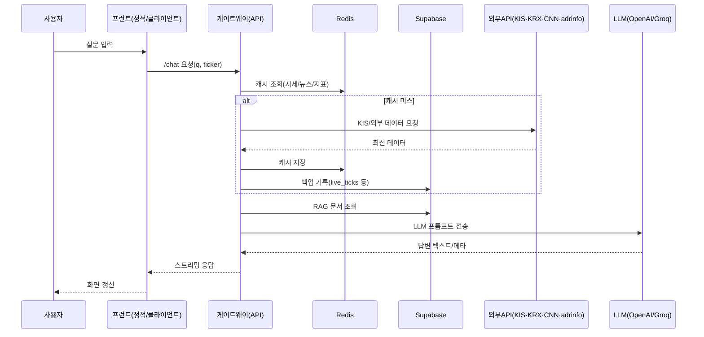

title: "jujuclub 구조 해설"
created: "2025-11-12T01:10:04Z"
repo: "jujuclub"
stack:

- "Node.js 22 / Express 4 (경량 웹 서버 프레임워크)"
- "Supabase (Postgres 기반 백엔드 서비스) & Upstash Redis (서버리스 캐시)"
- "OpenAI + Groq LLM (대규모 언어 모델)"
- "KIS OpenAPI & KRX 데이터 API & CNN Fear & Greed 지표"
- "웹소켓 폴링 워커(ws) + Redis 기반 레이트 리미터"

---

# 0) 초간단 스냅샷(7줄)

1. 목적: 삼성전자 등 한국 주식용 데이터·뉴스·지표를 모아 페르소나 챗봇 API로 제공한다.
2. 주기술: Express 서버와 WS 폴러(worker)가 Redis·Supabase를 매개로 LLM(OpenAI·Groq)을 호출한다.
3. 진입점: `services/gateway/src/server.js:~1`에서 Express 서버가 `/chat`·`/diag-*` 라우트를 연다.
4. 데이터: Supabase `live_ticks`·`rag_docs`·`personas` 테이블과 Upstash Redis 캐시를 사용한다.
5. 외부 API: KIS OpenAPI, KRX VKOSPI, CNN Fear & Greed, [adrinfo.kr](http://adrinfo.kr/), OpenAI, Groq SDK 등.
6. 배포: 추정: Dockerfile 존재(`services/gateway/Dockerfile`), 자체 호스팅 또는 컨테이너 환경 대상.
7. 리스크: 다수의 비공개 키 필요, 외부 사이트 차단 가능성, 단일 티커(005930) 하드코딩.

# 1) 폴더 지도(깊이 2~3)

services/
gateway/ — Express 기반 API·LLM 게이트웨이 (src/에 라우트·지표 계산 로직)
shared/ — KIS OpenAPI 클라이언트와 Redis 레이트 리미터
ws-consumer/ — KIS 시세·뉴스 폴링 워커(웹소켓 아님, 주기적 REST 호출)
scripts/
ingest.js — 문서(RAG) 임베딩 후 Supabase에 적재하는 CLI
sample_docs/
005930.KS/ — RAG 입력 예시 텍스트
sql/
01_schema.sql / 02_functions.sql — 추정: Supabase용 스키마/함수 초안 자리
node_modules/ — 루트 의존성 (생략)
services/gateway/public/ — 정적 헬스 페이지 및 간단 UI

# 2) 실행 경로(러닝루트)

- 사용자 액션: 웹/클라이언트에서 `/chat?q=...&ticker=005930.KS` 호출.
- 프런트: 정적 안내 페이지(`services/gateway/public/index.html:~1`, 필요 시 자체 UI 구현).
- 백엔드: `services/gateway/src/server.js:~593`의 `/chat` 핸들러가 의도 분석 → 데이터 수집 → LLM 호출.
- DB/외부: Redis(`services/gateway/src/server.js:~205`), Supabase(`services/gateway/src/server.js:~215`), KIS(`services/gateway/src/kis.js:~87`), CNN(`services/gateway/src/cnn.js:~145`), [adrinfo.kr](http://adrinfo.kr/)(`services/gateway/src/adrCrawler.js:~47`), KRX(`services/gateway/src/krx.js:~154`), OpenAI/Groq(`services/gateway/src/server.js:~158`).

# 3) 라우트·엔드포인트 표(최대 12개)

| 경로 | 메서드 | 담당 파일 | 요약 역할 |
| --- | --- | --- | --- |
| / | GET | `services/gateway/src/server.js:~411` | 상태 확인 문구 반환 |
| /health | GET | `services/gateway/src/server.js:~413` | 서버 시간 포함 기본 헬스체크 |
| /diag | GET | `services/gateway/src/server.js:~415` | 필수 환경변수 설정 여부 보고 |
| /diag-krx | GET | `services/gateway/src/server.js:~427` | VKOSPI 개장가 조회(KRX API) |
| /diag-adr | GET | `services/gateway/src/server.js:~442` | ADR 수집([adrinfo.kr](http://adrinfo.kr/) 또는 KIS) |
| /diag-volume | GET | `services/gateway/src/server.js:~476` | 거래량 비율 캐시 리포트 |
| /diag-weather | GET | `services/gateway/src/server.js:~489` | 종합 지표(지수·ADR·FGI 등) |
| /diag-cnn | GET | `services/gateway/src/server.js:~502` | CNN Fear & Greed 갱신 |
| /diag-mood | GET | `services/gateway/src/server.js:~517` | 주가/코스피 비교로 감정 분류 |
| /diag-redis | GET | `services/gateway/src/server.js:~567` | Redis 연결 확인 |
| /chat-test | GET (SSE) | `services/gateway/src/server.js:~580` | 스트리밍 예제 |
| /chat | GET (SSE/JSON) | `services/gateway/src/server.js:~593` | 메인 챗봇 응답 생성 |

# 4) 데이터 흐름

- 스키마/모델: Supabase `rag_docs`, `personas`, `live_ticks` 등을 사용 (`services/gateway/src/server.js:~215`).
- 주요 테이블/컬렉션: `live_ticks`(실시간 시세), `rag_docs`(임베딩 문서), `personas`(화자 메타), Redis 키 `live:*`, `news:*`, `macro:*`.
- 읽기/쓰기 패턴: WS 폴러가 시세·뉴스를 Redis/Supabase에 주기 저장(`services/ws-consumer/src/index.js:~55`), 게이트웨이가 Redis 우선 조회 후 Supabase 백필(`services/gateway/src/server.js:~203`).
- 상태관리/캐시/에러: Upstash Redis TTL 기반 캐시, Supabase fallback, 에러 발생 시 로그 및 `ok:false` 응답(`services/gateway/src/macroWeather.js:~147`); 레이트 리미터는 Redis 키 기반(`services/shared/kisRateLimiter.js:~28`).

# 5) 외부 연동

- KIS OpenAPI(토큰 기반, 호출: `services/shared/kisClient.js:~119`): 시세/뉴스/차트/시장폭 조회.
- KRX 데이터 API(Bearer 키, 호출: `services/gateway/src/krx.js:~110`): VKOSPI 지표.
- [adrinfo.kr](http://adrinfo.kr/)(스크레이핑, 호출: `services/gateway/src/adrCrawler.js:~47`): KOSPI ADR 값.
- CNN Fear & Greed(REST + 쿠키, 호출: `services/gateway/src/cnn.js:~145`): 시장 심리 지표.
- OpenAI Embeddings & Chat(키 인증, 호출: `services/gateway/src/server.js:~187`, `services/gateway/src/retrieval.js:~8`): 임베딩·LLM.
- Groq LLM(API 키, 호출: `services/gateway/src/server.js:~324`): 답변 생성 및 뉴스 필터.
- Supabase(Postgres, 서비스 키, 호출: `services/gateway/src/server.js:~197`): 문서/시세 저장.
- Upstash Redis(REST 토큰, 호출: `services/gateway/src/server.js:~185`): 캐시·레이트 리미터.

# 6) 환경변수·설정(값 노출 금지)

- SUPABASE_URL / SUPABASE_SERVICE_ROLE_KEY — Supabase 접속; 누락 시 Persona·문서·시세 저장 실패.
- OPENAI_API_KEY — 임베딩·LLM 호출; 없으면 검색·챗이 동작 안 함.
- GROQ_API_KEY — 답변 LLM; 없으면 `/chat` 응답 실패.
- UPSTASH_REDIS_REST_URL / UPSTASH_REDIS_REST_TOKEN — 캐시·레이트 리미터; 누락 시 속도 저하·중복 호출.
- KIS_APPKEY / KIS_SECRET (또는 APP_KEY / SECRET_KEY) — KIS API 인증; 누락 시 시세/뉴스 폴링과 `/chat` 가격 정보 중단(`services/shared/kisClient.js:~70`).
- KIS_CUSTTYPE / KIS_ENV — KIS 호출 설정; 기본값 존재하나 실계좌 환경 맞춰 조정.
- KIS_RATE_LIMIT_* — 요청 간격·대기 제한 (`services/shared/kisRateLimiter.js:~5`); 지나치게 낮으면 에러.
- KRX_API_KEY — VKOSPI 조회 필수 (`services/gateway/src/krx.js:~110`); 누락 시 `/diag-krx` 실패.
- CNN_FGI_* — CNN 호출 헤더/타임아웃; 기본값 존재하나 차단 시 튜닝.
- VOLUME_RATIO_* — 거래량 잡 주기·대기 설정 (`services/gateway/src/volumeJob.js:~12`); 미설정 시 기본 5분.
- PORT — Express 포트 (기본 8080).
- WS 전용 `.env.ws`: SUPABASE_URL/KEY, REDIS, KIS 키 등 (`services/ws-consumer/src/index.js:~18`).

# 7) 빌드/실행/배포 파이프라인

- 패키지/스크립트: npm (각 서비스 하위 `package.json`), 주요 스크립트 `npm start`.
- CI/CD: 추정: `.github` 폴더 없음 → 수동 배포.
- 배포 타깃: 추정: Dockerfile 기반 컨테이너 (gateway·ws-consumer 각자).
- **로컬 실행 3단계**
    1. `.env.gateway`·`.env.ws`에 필수 키 작성.
    2. `cd services/gateway && npm install && npm start`.
    3. 별도 터미널에서 `cd services/ws-consumer && npm install && npm start`.
- **배포 3단계**
    1. Docker 이미지 빌드(`docker build -t gateway services/gateway` 등, 추정).
    2. 환경변수 주입 후 컨테이너 실행(또는 오케스트레이션 등록).
    3. Supabase/Redis/KIS/외부 API 키를 비밀 저장소에 등록.

# 8) 테스트 전략(있다면)

- 러너/프레임워크: 사용 흔적 없음.
- 커버리지/스냅샷: 없음.
- 추천 테스트 포인트: KIS API 모킹 후 `/chat` 통합 테스트, `macroWeather` 계산 단위 테스트, `adrCrawler` HTML 파서 테스트.

# 9) 보안/운영 체크

- 인증/권한: 서비스 롤 키(Supabase) 사용 → 서버 전용 보관 필수.
- CORS/레이트리밋: CORS 전역 허용(`services/gateway/src/server.js:~27`), 별도 제한 없음 → 추후 강화 필요.
- 로깅/모니터링: 콘솔 로그 중심; 구조화/집중화 필요.
- 비밀관리: `.env.gateway`·`.env.ws` 사용, 깃에 올리지 않도록 주의.

# 10) 용어 미니사전

- ADR(Advance Decline Ratio): 상승·하락 종목 비율 지표.
- VKOSPI: KRX 변동성 지수.
- RAG(Retrieval-Augmented Generation): 문서 검색 후 답변 생성 방식.
- KIS: 한국투자증권 OpenAPI.
- FGI(Fear & Greed Index): CNN 공포·탐욕 지표.
- 폴러(poller): 주기적으로 API를 호출하는 워커.

# 11) 리스크/기술부채/TODO Top5

1. 단일 티커(005930) 하드코딩으로 다종목 확장 어려움 (근거: `services/ws-consumer/src/index.js:~24`).
2. Supabase 서비스 롤 키가 서버 코드에 직결 → 비노출 환경 필수, 권한 분리 필요 (`services/gateway/src/server.js:~155`).
3. 외부 스크레이핑([adrinfo.kr](http://adrinfo.kr/)) 차단 시 재시도 로직 부족 (`services/gateway/src/adrCrawler.js:~62`).
4. CORS 무제한 허용 → 공개 API 시 남용 위험 (`services/gateway/src/server.js:~26`).
5. 테스트·CI 부재로 주요 엔드포인트 회귀 검증 어려움 (전역).

# 12) 90분 익히기 로드맵(15분 단위)

- 0~15분: 루트 구조·환경변수 목록 파악(`package.json`, `services/gateway/package.json`).
- 15~30분: `services/` 하위 역할 읽기(게이트웨이·WS 폴러·shared).
- 30~45분: `/chat` 처리 흐름 추적(`services/gateway/src/server.js`).
- 45~60분: KIS 클라이언트·레이트 리미터 이해(`services/shared/kisClient.js`, `kisRateLimiter.js`).
- 60~75분: `.env` 템플릿 작성 후 로컬 Redis/Supabase 연결 확인.
- 75~90분: `/diag-*` 호출로 전체 데이터 파이프 검증, 개선 포인트 기록.

# 13) 드릴다운 Top5 파일/폴더

## 13-1) services/gateway/src/server.js

- 목적: Express 서버, `/chat` 포함 모든 진단 라우트 구현.
- 인터페이스: 기본 GET 라우트, `/chat` SSE/JSON 응답, `startVolumeRatioJob()` 호출.
- 내부 흐름(3~5단계): (1) 미들웨어 설정 및 정적 제공(`:~26`), (2) 헬스·진단 라우트 정의(`:~413`), (3) `/chat`에서 의도 분석·데이터 수집·LLM 호출(`:~599`), (4) SSE 스트리밍 또는 JSON 응답 조립(`:~817`).
- 의존성: `kis.js`, `krx.js`, `cnn.js`, `macroWeather.js`, `adrCrawler.js`, `groq-sdk`, `openai`, Redis, Supabase.
- 부작용/실패 케이스: 외부 API 실패 시 `ok:false` 반환, Redis/Supabase 오류 로그만 출력.
- 테스트 가이드: `/chat?stream=false` 통합 테스트 시 KIS·Redis 모킹, `/diag-*` 성공/실패 케이스 확인.
- 리팩터 제안(Top3): (1) 비즈니스 로직 모듈화, (2) 입력 파라미터 검증 추가, (3) LLM 지침/섹션 생성 분리로 테스트 가능성 향상.

## 13-2) services/gateway/src/macroWeather.js

- 목적: 지수·ADR·거래량·FGI 데이터를 점수화하여 “시장 체감 온도” 산출.
- 인터페이스: `computeMacroWeatherScore`, `mapWeatherThermometer`, `fetchMacroWeather`.
- 내부 흐름: (1) 입력값 정규화 및 점수화(`:~25`), (2) 보조지표 계산/클램핑(`:~31`), (3) CNN FGI 조정(`:~45`), (4) 종합 점수·라벨 반환(`:~74`), (5) Promise.allSettled로 외부 데이터 수집(`:~133`).
- 의존성: `kis.js`, `krx.js`, `cnn.js`, `adrCrawler.js`, Redis.
- 부작용: 외부 API 에러 로그 누적, `errors` 배열에 사유 기록.
- 테스트 가이드: 모킹된 입력으로 점수/라벨 기대값 검증.
- 리팩터 제안: (1) 지표별 가중치 설정 노출, (2) 실패시 fallback 전략 강화, (3) 타입 정의 추가.

## 13-3) services/shared/kisClient.js

- 목적: KIS OpenAPI 호출 공통 모듈.
- 인터페이스: `getStockQuote`, `getIndexQuote`, `getNews`, `getStockDailyChart`, `getIndexCategoryPrice`, `getIndexDailyVolumes`, `getIndexDailyBreadth`, `getAccessToken` 등.
- 내부 흐름: (1) 환경설정 확인(`:~60`), (2) 토큰 발급(`:~82`), (3) 레이트 리미터 획득(`:~228`), (4) Axios 호출 후 응답 정규화.
- 의존성: Axios, Redis 레이트 리미터(`kisRateLimiter.js`), 환경변수.
- 부작용: 잘못된 응답 시 콘솔 경고, 토큰 재사용 없이 매 호출 토큰 발급(성능 고려 필요).
- 테스트 가이드: Axios 모킹으로 성공/실패 응답 검증, 레이트 리미터 간격 단위 테스트.
- 리팩터 제안: (1) 토큰 캐시 구현, (2) 에러 메시지 국제화/정형화, (3) 입력 파라미터 타입 정의.

## 13-4) services/ws-consumer/src/index.js

- 목적: 실시간 데이터 폴러로 Redis/Supabase 캐시 채우기.
- 인터페이스: 실행 시 주기적 setInterval, 외부 노출 없음.
- 내부 흐름: (1) 환경 로드 및 클라이언트 준비(`:~16`), (2) 시세/지수/뉴스/히스토리 폴링(`:~68`, `:~93`, `:~103`), (3) Redis·Supabase 저장(`:~55`).
- 의존성: `shared/kisClient`, Supabase, Upstash Redis.
- 부작용: API 실패 시 콘솔 에러, 단일 티커·지수만 처리.
- 테스트 가이드: 폴링 함수 분리 후 KIS 응답 모킹, TTL/insert 확인.
- 리팩터 제안: (1) 다중 티커 파라미터화, (2) 에러 재시도·백오프 통합, (3) 로깅 레벨 관리.

## 13-5) services/gateway/src/volumeJob.js

- 목적: 거래량 비율 계산 백그라운드 잡.
- 인터페이스: `startVolumeRatioJob`, `computeAndStoreVolumeRatio`, `getCachedVolumeRatio`.
- 내부 흐름: (1) KIS 자격 확인(`:~90`), (2) 스냅샷·히스토리 조회(`:~98`), (3) 평균 대비 비율 계산(`:~126`), (4) Redis 저장 및 다음 스케줄 계산(`:~145`, `:~184`).
- 의존성: Supabase Redis, `shared/kisClient`.
- 부작용: KIS 레이트 리밋시 지연, Redis 쓰기 실패 시 로그만 남김.
- 테스트 가이드: `getIndexCategoryPrice` 모킹으로 ratio 계산 검증, 타이밍 파라미터 단위 테스트.
- 리팩터 제안: (1) 잡 스케줄러 추상화, (2) 실패 시 알림 시스템 연동, (3) 통계치(표준편차 등) 확장 옵션.

# 부록A) 주요 명령어 Top10

- `cd services/gateway && npm install` — 게이트웨이 의존성 설치.
- `cd services/gateway && npm start` — Express 서버 실행(`node --env-file=../../.env.gateway src/server.js`).
- `cd services/ws-consumer && npm install` — 폴러 의존성 설치.
- `cd services/ws-consumer && npm start` — 시세/뉴스 폴러 실행.
- `node scripts/ingest.js ./sample_docs/005930.KS 005930.KS` — 예시 문서 Supabase RAG 적재.
- `curl <http://localhost:8080/diag`> — 환경 설정 점검.
- `curl "<http://localhost:8080/diag-krx?basDd=20251112>"` — VKOSPI 확인.
- `curl "<http://localhost:8080/diag-adr?force=true>"` — ADR 스크레이핑 확인.
- `curl "<http://localhost:8080/diag-volume>"` — 거래량 비율 캐시 확인.
- `curl "<http://localhost:8080/chat?q=오늘+전망&&stream=false>"` — 챗봇 응답 테스트.

# 부록B) Mermaid 다이어그램

## B-1) 아키텍처

```mermaid
flowchart LR
  User((사용자))
  UI[정적 페이지/클라이언트]
  API[Gateway (Express)]
  Worker[WS Consumer 폴러]
  Redis[(Upstash Redis)]
  Supa[(Supabase Postgres)]
  ExtAPI[[KIS / KRX / CNN / adrinfo.kr]]
  LLM[[OpenAI & Groq]]
  User --> UI --> API
  Worker --> Redis
  Worker --> Supa
  API --> Redis
  API --> Supa
  API --> ExtAPI
  API --> LLM
  Worker --> ExtAPI

```

## B-2) 데이터플로우

